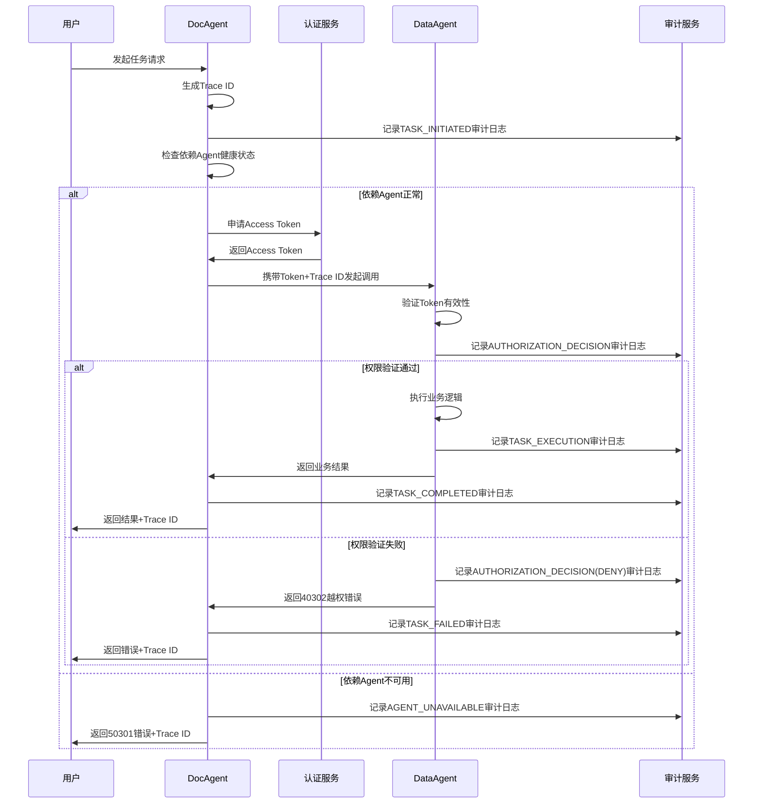

# 系统协议文档
## 1. 协议概述
本文档定义Agent身份与权限系统的交互协议，涵盖正常业务流程、异常处理机制和边界场景处理规范，所有Agent服务必须遵循本协议进行交互。

## 2. 通用约定
### 2.1 错误码规范
| 错误码 | 含义 | 说明 |
|--------|------|------|
| 0 | 成功 | 请求处理成功 |
| 40001 | 参数错误 | 请求参数缺失或格式错误 |
| 40101 | Token缺失 | 请求未携带Access Token |
| 40102 | Token无效 | Token签名错误或格式错误 |
| 40103 | Token过期 | Token已超过有效期 |
| 40104 | Token已吊销 | Token已被主动吊销 |
| 40301 | 权限不足 | Agent没有访问当前资源的权限 |
| 40302 | 越权访问 | 尝试访问超出授权范围的资源 |
| 50001 | 服务内部错误 | 服务处理时发生未知错误 |
| 50301 | 服务不可用 | 依赖的Agent服务未启动或无法访问 |
| 50401 | 调用超时 | 跨Agent调用超时 |

### 2.2 响应格式规范
所有接口响应采用统一JSON格式：
```json
{
  "code": 0,
  "message": "success",
  "data": {},
  "trace_id": "95735efd-cb0f-416b-9e96-4053871d2307"
}
```
| 字段 | 类型 | 必填 | 说明 |
|------|------|------|------|
| code | Integer | 是 | 错误码，0表示成功 |
| message | String | 是 | 响应消息 |
| data | Any | 否 | 响应数据 |
| trace_id | String | 是 | 全链路Trace ID |

## 3. 正常业务流程
### 3.1 任务发起流程


### 3.2 Token申请接口
**接口地址**：`POST /auth/issue-token`
**请求参数**：
```json
{
  "agent_id": "doc_agent_001",
  "agent_role": "service",
  "agent_name": "飞书文档助手Agent",
  "capabilities": ["bitable:read"],
  "delegated_user": {"user_id": "u_123", "name": "张三"},
  "expires_in": 7200
}
```
**响应参数**：
```json
{
  "code": 0,
  "message": "success",
  "data": {
    "access_token": "eyJhbGciOiJSUzI1NiIsInR5cCI6IkpXVCJ9...",
    "jti": "a1b2c3d4-5678-90ef-ghij-klmnopqrstuv",
    "expires_in": 7200
  },
  "trace_id": "xxx"
}
```

### 3.3 Token验证中间件
所有Agent接口必须集成Token验证中间件，校验规则：
1. 从请求头`Authorization: Bearer <token>`中获取Token
2. 验证Token签名、有效期、是否被吊销
3. 验证Token包含当前接口所需的权限
4. 验证通过后将Token payload存入请求上下文
5. 验证失败直接返回对应错误码

## 4. 异常处理机制
### 4.1 Token异常处理
| 异常类型 | 处理逻辑 | 返回错误码 |
|----------|----------|------------|
| Token缺失 | 直接拒绝请求，提示需要认证 | 40101 |
| Token格式错误 | 直接拒绝请求，提示Token无效 | 40102 |
| Token签名错误 | 直接拒绝请求，提示Token无效 | 40102 |
| Token过期 | 拒绝请求，提示需要重新申请Token | 40103 |
| Token已吊销 | 拒绝请求，提示Token已失效 | 40104 |
| 权限不足 | 拒绝请求，记录越权审计日志 | 40302 |

### 4.2 服务异常处理
| 异常类型 | 处理逻辑 | 返回错误码 |
|----------|----------|------------|
| 依赖Agent不可用 | 记录AGENT_UNAVAILABLE审计日志，返回服务不可用错误 | 50301 |
| 跨Agent调用超时 | 记录TASK_FAILED审计日志，返回超时错误 | 50401 |
| 服务内部错误 | 记录错误堆栈和审计日志，返回内部错误 | 50001 |
| 参数校验失败 | 记录参数错误审计日志，返回参数错误 | 40001 |

## 5. 边界场景处理
### 5.1 网络异常场景
- 跨Agent调用超时：最长等待时间30秒，超时后重试1次，仍然失败则返回超时错误
- 网络抖动导致请求重复：所有接口必须实现幂等性，相同Trace ID的请求仅处理一次
- 网络中断导致日志丢失：审计日志采用本地先写缓存，异步批量落盘策略，最多丢失1秒内的日志

### 5.2 权限边界场景
- 多级委托权限收敛：每一级委托只能传递小于等于自身权限的子集，不能越权委托
- 权限过期处理：Token有效期内权限变更不影响当前Token，新权限在下次申请Token时生效
- 公共资源访问：无需Token即可访问的公共资源必须在白名单中明确配置

### 5.3 数据边界场景
- 数据越权访问：必须校验数据归属权限，禁止访问不属于当前用户/Agent的数据
- 大文件导出：审计日志导出超过1000条时采用分页导出，避免内存溢出
- 空数据处理：查询结果为空时返回空列表，不能抛出异常

### 5.4 高并发场景
- Token验证缓存：验证通过的Token缓存5分钟，减少重复验签开销
- 审计日志异步写入：高并发场景下审计日志采用异步队列写入，不阻塞主业务流程
- 限流保护：单个Agent调用频率超过阈值时返回429限流错误，保护服务稳定性

## 6. 安全规范
1. 所有交互必须通过HTTPS或内部安全信道，禁止明文传输Token
2. Token禁止存储于前端代码、日志、配置文件中，仅在内存中传递
3. 私钥必须存储于服务端本地，禁止上传到代码仓库或公网
4. 审计日志禁止包含敏感信息（如密码、密钥）
5. 所有异常信息不得泄露服务内部细节，仅返回通用错误提示
