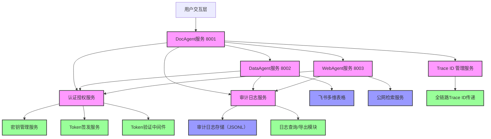

# 系统架构图
## 整体架构

## 技术栈选型
| 层级 | 技术选型 | 说明 |
|------|----------|------|
| 服务框架 | FastAPI | 提供RESTful API接口，支持异步处理 |
| 认证算法 | RSA256非对称加密 | 动态Token签发与验证，无静态密钥泄露风险 |
| Token标准 | JWT (JSON Web Token) | 自包含式Token，包含完整权限信息 |
| 日志存储 | JSON Lines (JSONL) | 行级存储，便于流式查询和导出 |
| 全链路追踪 | UUID v4 | 全局唯一Trace ID，实现全链路可追溯 |
| 权限控制 | ABAC (属性基访问控制) | 基于Agent属性、资源属性、上下文属性的动态权限决策 |
| 加密存储 | 本地密钥文件 | 私钥存储于服务端本地，公钥公开用于验证 |

## 数据流向
1. 用户请求 → DocAgent → 生成Trace ID → 记录任务启动审计日志
2. DocAgent → 认证服务 → 签发访问Token → 传递给DataAgent/WebAgent
3. DataAgent/WebAgent → 验证Token → 执行权限检查 → 记录授权决策审计日志
4. 业务执行完成 → 记录任务完成/失败审计日志 → 返回结果给用户
5. 审计日志统一写入JSONL文件 → 支持多条件查询和JSON/CSV导出
